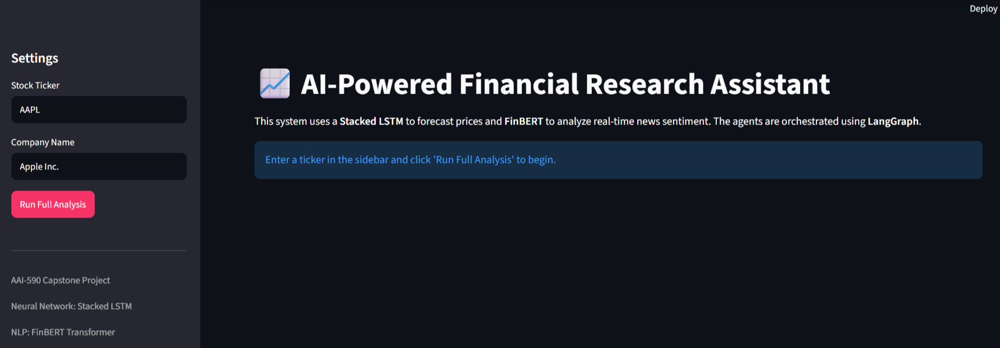

# AI-Powered Financial Analyst

## Project Description

This project implements an AI-powered financial analyst that provides investment research by integrating various data sources and analytical models. It leverages Deep Learning (LSTM) for stock price forecasting and Natural Language Processing (FinBERT) for news sentiment analysis, all orchestrated by a LangGraph state machine.

The goal is to provide a comprehensive report for a given stock ticker, combining quantitative market predictions with qualitative news sentiment to offer a final investment recommendation.

## Key Features

* **Stock Data Acquisition & Preprocessing:** Fetches historical stock data using `yfinance`, cleans it, and computes essential technical indicators (e.g., Moving Averages, RSI, MACD, Volatility, Daily Returns).
* **Deep Learning Price Forecasting (LSTM):** Trains and utilizes an LSTM neural network to predict future stock closing prices based on the engineered technical indicators and historical price patterns.
* **NLP News Sentiment Analysis (FinBERT):** Retrieves recent news headlines for a specified company via NewsAPI and performs advanced sentiment analysis using FinBERT, a transformer model pre-trained on financial text.
* **Agent Orchestration (LangGraph):** Uses LangGraph to define a state machine that orchestrates the flow of information between specialized agents: a Market Analyst, a News Analyst, and a Report Generator.
* **Comprehensive Report Generation:** Synthesizes the market analysis (price prediction) and news sentiment into a structured investment research report, culminating in a clear "BUY", "HOLD", or "SELL" recommendation based on combined signals.

## Project Structure

```
.
├── data/
│   └── clean_stock_data_AAPL.csv  # Cleaned and feature-engineered stock data
├── models/
│   └── lstm_model.pth             # Trained LSTM model weights
├── notebooks/
│   ├── 01_Exploratory_Data_Analysis.ipynb
│   └── 02_Deep_Learning_Training.ipynb
├── src/
│   ├── agents.py                  # Agent logic (Market, News, Report)
│   ├── app.py                     # Streamlit UI Dashboard
│   ├── data_loader.py             # Data fetching, cleaning, feature engineering, scaling, sequence creation
│   ├── models.py                  # LSTM Neural Network architecture
│   ├── retrieval.py               # NewsAPI integration, FinBERT sentiment analysis
│   └── main.py                    # LangGraph orchestration of agents
├── .env                           # Environment variables (e.g., API keys) - **DO NOT COMMIT!**
├── README.md                      # This file
└── requirements.txt               # Project dependencies
```

## Setup and Installation

### 1. Clone the Repository

```bash
git clone https://github.com/unrivalle/AAI-590_project_work.git
cd capstone
```

### 2. Create and Activate a Virtual Environment (Recommended)

```bash
python -m venv venv
# On Windows:
.\venv\Scripts\activate
# On macOS/Linux:
source venv/bin/activate
```

### 3. Install Dependencies

```bash
pip install -r requirements.txt
```

### 4. Configure API Keys

You need a NewsAPI key for fetching news.

* Go to [https://newsapi.org/](https://newsapi.org/) and sign up for a free developer API key.
* Create a `.env` file in the root directory of your project (same level as `README.md`).
* Add your API key to the `.env` file:

```env
NEWS_API_KEY="YOUR_NEWSAPI_KEY_HERE"
```

**Replace `"YOUR_NEWSAPI_KEY_HERE"` with your actual API key.**

## Usage

### Step 1: Exploratory Data Analysis (EDA)

Navigate to the `notebooks/` directory and open `01_Exploratory_Data_Analysis.ipynb`.

This notebook will:

* Load historical stock data and compute technical indicators.
* Perform initial data cleaning and preprocessing.
* Visualize various aspects of the data (price, volume, returns, technical indicators).
* Conduct a stationarity test (Augmented Dickey-Fuller) for time series properties.
* Generate a correlation matrix for the features.

Run all cells in this notebook to understand your data.

### Step 2: Train the Deep Learning Model

Navigate to the `notebooks/` directory and open `02_Deep_Learning_Training.ipynb`.

This notebook will:

* Load the preprocessed data and prepare it into sequences suitable for LSTM.
* Define, initialize, and train the LSTM model.
* Plot training and validation loss curves.
* Save the trained model weights to `models/lstm_model.pth`.
* Evaluate the model on the test set and visualize predictions against actual prices.

**It is crucial to run this notebook first to train and save the LSTM model before running `main.py`.** The `MarketAgent` in `main.py` relies on this saved model.

### Step 3: Launching the System

You can run the system in two ways:

#### A. Console Output (CLI):

After completing Step 1 and Step 2, you can run the main orchestration script.

```bash
python src/main.py
```

This script will:

1. Load the latest historical stock data for the specified `TARGET_TICKER`.
2. Initialize the `MarketAgent` (which loads the trained LSTM model).
3. Initialize the `NewsAgent` (which loads the FinBERT model on its first use).
4. Invoke the LangGraph workflow:
   * **Market Analysis:** The `MarketAgent` predicts the next day's closing price.
   * **News Analysis:** The `NewsAgent` fetches news for `COMPANY_FOR_NEWS` and analyzes its sentiment.
   * **Report Generation:** The `ReportAgent` combines the market prediction and news sentiment into a final report with an investment recommendation.
5. Print the comprehensive investment research report to the console.

#### B. Interactive Dashboard (Recommended):

```bash
# This provides the full ML System experience with visualizations
streamlit run src/app.py
```

## Customization

* **`src/main.py`:** Modify `TARGET_TICKER`, `COMPANY_FOR_NEWS`, `START_DATE`, `END_DATE` to analyze different stocks.
* **`src/data_loader.py`:** Adjust `sequence_length` or add/remove technical indicators.
* **`src/models.py`:** Experiment with `LSTM_HIDDEN_SIZE`, `LSTM_NUM_LAYERS`, `DROPOUT_RATE` or even different network architectures (e.g., add more LSTM layers, change to GRU).
* **`src/agents.py`:** Refine the `ReportAgent`'s `generate` method for a more sophisticated recommendation logic.
* **`notebooks/02_Deep_Learning_Training.ipynb`:** Tweak `LEARNING_RATE`, `NUM_EPOCHS`, `BATCH_SIZE` for better model performance.
* **Generalization:** While the default model is trained on AAPL, you can retrain the LSTM in Notebook 02 for any ticker (e.g., NVDA, TSLA) to improve ticker-specific accuracy.

## Disclaimer

Stock market predictions are inherently uncertain, and any investment decisions should be made based on thorough personal research and/or consultation with a professional financial advisor.
